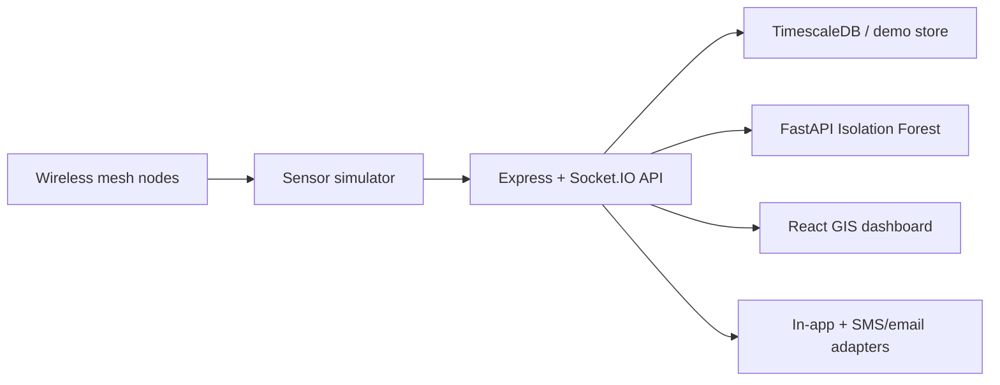

# MineGuard AI architecture

The prototype keeps an in-memory store as a zero-setup fallback. The Compose stack provisions TimescaleDB for the next persistence increment and exposes the same data contract to the UI.
